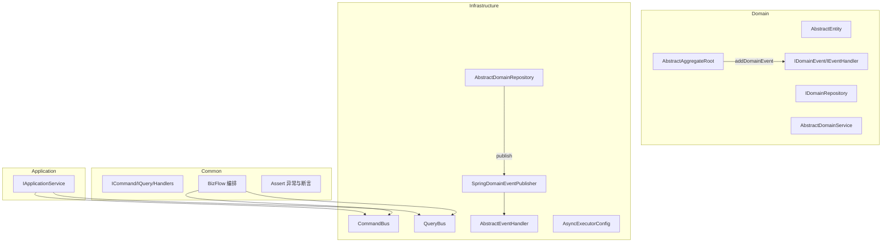
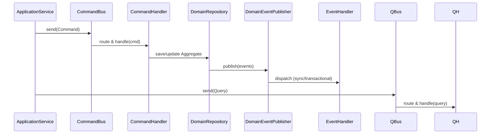

# easy-ddd

一个面向 Java/Spring 的轻量级 DDD 基础设施与业务编排套件，内置 CQRS（命令/查询总线）、领域事件发布与处理、仓储抽象、异步执行器配置、以及可组合的业务流程编排（BizFlow）。

## 模块概览
- `easy-ddd-bom`：统一版本与依赖管理的 BOM。
- `easy-ddd-common`：通用组件（CQRS 接口、断言、BizFlow 编排）。
- `easy-ddd-domain`：领域模型与事件、仓储接口、领域服务基类。
- `easy-ddd-application`：应用服务接口（编排用例、桥接总线）。
- `easy-ddd-infrastructure`：命令/查询总线、事件发布器与处理器、仓储基础实现、异步执行器自动配置。

子模块文档：
- [easy-ddd-bom](easy-ddd-bom/README.md)
- [easy-ddd-common](easy-ddd-common/README.md)
- [easy-ddd-domain](easy-ddd-domain/README.md)
- [easy-ddd-application](easy-ddd-application/README.md)
- [easy-ddd-infrastructure](easy-ddd-infrastructure/README.md)

## 架构图


## 功能清单
- CQRS 总线：基于 Spring 容器自动匹配处理器、支持同步与异步执行。
- 领域事件：发布器可注入，默认 Spring 实现，支持事务阶段触发与异步处理。
- 仓储抽象：提供通用增删改查骨架，自动发布聚合根事件。
- 业务编排：`BizFlow` 支持命令、查询、条件、通用节点，导出 PlantUML。
- 异步执行器：命令/查询/事件专用线程池，支持属性参数化。

## 优势与劣势
- 优势：
  - 模块职责清晰，层次分明，便于维护与扩展。
  - 与 Spring 良好集成，开箱即用自动装配与事件机制。
  - CQRS 与编排结合，易于表达复杂业务用例。
  - 可调的异步执行器，提升吞吐与响应性能。
- 劣势：
  - 引入多层抽象与总线，学习曲线相对较高。
  - 默认不包含具体持久化实现，需要结合 ORM/DAO。
  - 事件全局发布器依赖框架初始化，测试需显式配置。

## 快速开始
1. 引入 BOM 管理与模块依赖（见 [easy-ddd-bom](easy-ddd-bom/README.md)）。
2. 启用自动配置：确保类路径包含 `easy-ddd-infrastructure`，Spring Boot 自动装配会注册总线/事件与执行器。
3. 编写命令/查询与处理器，注册为 Spring Bean：

```java
// 命令与处理器
class RegisterUserCommand implements ICommand<String> { /* 字段与校验 */ }

@Component
class RegisterUserHandler implements ICommandHandler<RegisterUserCommand, String> {
  @Override public String handle(RegisterUserCommand cmd) { /* 业务 */ return "OK"; }
  @Override public Class<RegisterUserCommand> getSupportedCommandType() { return RegisterUserCommand.class; }
}

// 查询与处理器
class GetUserProfileQuery implements IQuery<UserProfile> { /* 参数与校验 */ }

@Component
class GetUserProfileHandler implements IQueryHandler<GetUserProfileQuery, UserProfile> {
  @Override public UserProfile handle(GetUserProfileQuery q) { /* 读取 */ return new UserProfile(); }
  @Override public Class<GetUserProfileQuery> getSupportedQueryType() { return GetUserProfileQuery.class; }
}
```

4. 在应用服务中编排用例：
```java
@Service
class UserAppService implements IApplicationService {
  @Resource private ICommandBus commandBus;
  @Resource private IQueryBus queryBus;
  public ICommandBus getCommandBus() { return commandBus; }
  public IQueryBus getQueryBus() { return queryBus; }

  public UserProfile registerAndLoad(RegisterUserCommand cmd) {
    commandBus.send(cmd);
    return queryBus.send(new GetUserProfileQuery());
  }
}
```

5. 使用 BizFlow 进行业务流程编排并导出流程图（见 [easy-ddd-common](easy-ddd-common/README.md)）。

## 配置说明（异步执行器）
通过 `easy.ddd.async.*` 属性定制三个线程池：`queryExecutor`、`commandExecutor`、`eventExecutor`。示例：
```yaml
easy:
  ddd:
    async:
      query:
        queueCapacity: 100
      command:
        maxPoolSizeMultiplier: 2.0
      event:
        keepAliveSeconds: 300
```

## 案例：注册用户触发事件
```java
// 领域事件
record UserRegisteredEvent(String userId) implements IDomainEvent {
  public String getEventType() { return "user.registered"; }
  public Object getAggregateId() { return userId; }
  public boolean isAsync() { return true; }
}

// 事件处理器（基础设施层）
@Component
class UserRegisteredHandler extends AbstractEventHandler<UserRegisteredEvent> {
  public Class<UserRegisteredEvent> getSupportedEventType() { return UserRegisteredEvent.class; }
  protected void doHandle(UserRegisteredEvent e) { /* 发送欢迎邮件等 */ }
}

// 仓储保存后发布事件（继承 AbstractDomainRepository）
class UserAggregate extends AbstractAggregateRoot<String> { /* ... */
  void markRegistered() { addDomainEvent(new UserRegisteredEvent(getId())); }
}
```

## 子模块联动
- Common 的 CQRS 与 BizFlow 为 Application/Infrastructure 提供契约与编排。[查看](easy-ddd-common/README.md)
- Domain 的事件与模型通过 Infrastructure 的发布器与处理器在 Spring 中生效。[查看](easy-ddd-domain/README.md)
- Application 通过总线调用命令与查询，承载用例编排。[查看](easy-ddd-application/README.md)
- Infrastructure 提供总线实现、事件发布与线程池，以及仓储基类。[查看](easy-ddd-infrastructure/README.md)

## 设计原理
- 分层清晰：Common 定义契约与编排，Domain 表达模型与事件，Application 编排用例并桥接总线，Infrastructure 提供与 Spring 深度集成的实现。
- 约定优于配置：处理器通过接口的“支持类型”自动被总线发现与缓存，无需额外路由配置。
- 事件驱动：聚合根收集事件，仓储在持久化操作后统一发布；处理器支持同步、事务后、回滚后等阶段，便于一致性策略设计。
- 可观察与可调优：命令/查询/事件线程池独立配置，可根据 CPU/IO 特性选择乘数与队列容量。

## 总线路由与处理器发现
- 处理器约定：实现 `ICommandHandler` 或 `IQueryHandler`，并实现 `getSupportedCommandType()` / `getSupportedQueryType()` 返回支持的消息类型。
- 路由过程：总线在启动时从 Spring 容器扫描并缓存处理器，`send()` 时按消息类型匹配对应处理器并调用 `handle()`。
- 错误与重试：处理器内部应使用 `Assert` 进行业务校验与异常抛出；如需重试建议在处理器或业务编排层以幂等策略实现。



## 事件生命周期与事务阶段
- 事件阶段枚举：`IN_PROCESS`（同步）、`AFTER_COMMIT`（事务提交后）、`AFTER_ROLLBACK`（事务回滚后）。默认 `AFTER_COMMIT`。
- 发布位置：仓储在 `save`/`update` 后统一发布聚合根收集的事件；也可在领域服务中人为发布。
- 处理机制：
  - `@EventListener` 处理 `IN_PROCESS` 事件（同步）。
  - `@TransactionalEventListener(AFTER_COMMIT)` 处理提交后的事件。
  - `@TransactionalEventListener(AFTER_ROLLBACK)` 处理回滚后的事件。
- 自定义阶段：使用 `TriggeredPhaseEvent` 为事件指定明确阶段。

## BizFlow 原理与使用
- 节点类型：命令节点、查询节点、条件节点、泛型函数节点（支持上下文读写）。
- 上下文：流程内共享 `Context`，可在节点间传递中间结果。
- 导出图：可生成 PlantUML 以辅助沟通与设计评审。
- 建议：将复杂跨聚合用例拆解为若干流程节点，保持每个节点职责单一与可测试。

## 测试指引
- 隔离测试处理器：对 `ICommandHandler`/`IQueryHandler` 使用 Spring 测试切片或直接实例化；通过桩实现仓储与事件发布器。
- 事件测试：在集成测试中注入 `DomainEventPublisher.EventPublisher`；验证 `AFTER_COMMIT`/`AFTER_ROLLBACK` 行为时使用事务性测试事务模板。
- BizFlow 测试：为每个节点提供独立用例；对条件节点提供正/负路径；可断言导出的 PlantUML 是否包含关键节点。

## 配置项详解（异步执行器）
通过 `easy.ddd.async.*` 属性定制三个线程池：`queryExecutor`、`commandExecutor`、`eventExecutor`。
- 通用属性：`corePoolSizeMultiplier`、`maxPoolSizeMultiplier`、`queueCapacity`、`keepAliveSeconds`、`rejectedExecutionPolicy`（`CALLER_RUNS`/`DISCARD_OLDEST`/`DISCARD`/`ABORT`）、`waitForTasksToCompleteOnShutdown`、`awaitTerminationSeconds`。
- 示例：
```yaml
easy:
  ddd:
    async:
      query:
        corePoolSizeMultiplier: 1.0
        maxPoolSizeMultiplier: 1.5
        queueCapacity: 50
        keepAliveSeconds: 60
        rejectedExecutionPolicy: CALLER_RUNS
        waitForTasksToCompleteOnShutdown: true
        awaitTerminationSeconds: 30
      command:
        corePoolSizeMultiplier: 1.0
        maxPoolSizeMultiplier: 1.5
        queueCapacity: 200
        keepAliveSeconds: 120
        rejectedExecutionPolicy: CALLER_RUNS
        waitForTasksToCompleteOnShutdown: true
        awaitTerminationSeconds: 45
      event:
        corePoolSizeMultiplier: 1.0
        maxPoolSizeMultiplier: 2.0
        queueCapacity: 500
        keepAliveSeconds: 300
        rejectedExecutionPolicy: CALLER_RUNS
        waitForTasksToCompleteOnShutdown: true
        awaitTerminationSeconds: 60
```
- Bean 名称与用途：`queryExecutor`（查询处理，偏 CPU）、`commandExecutor`（命令处理，平衡型）、`eventExecutor`（事件处理，偏 IO）。

## 性能与调优建议
- 线程池乘数：根据机器 CPU 核心与负载特点调整 `corePoolSizeMultiplier` 与 `maxPoolSizeMultiplier`。
- 队列容量：事件通常较多，适当提高 `event.queueCapacity`；查询以低延迟为主，维持较小队列。
- 处理器缓存：总线已缓存处理器映射，避免每次查找；如处理器较多，建议分类命名与包结构清晰。
- 幂等性：命令处理器要确保幂等以便在失败重试或消息重复时安全。
- 观察指标：可扩展 `MonitorableThreadPoolTaskExecutor`，采集 `activeCount`、`queueSize`、`completedTaskCount` 指标。

## 最佳实践
- 聚合根边界清晰：跨聚合一致性优先通过事件或流程编排协调。
- 仓储内发布事件：保持事件聚合在一次持久化之后统一发布，简化一致性管理。
- 领域事件语义化：事件类型命名遵循领域语言；避免技术细节泄漏到事件数据。
- 防腐层（ACL）：在应用层对外部系统数据/模型进行适配与转换，避免侵入领域层。