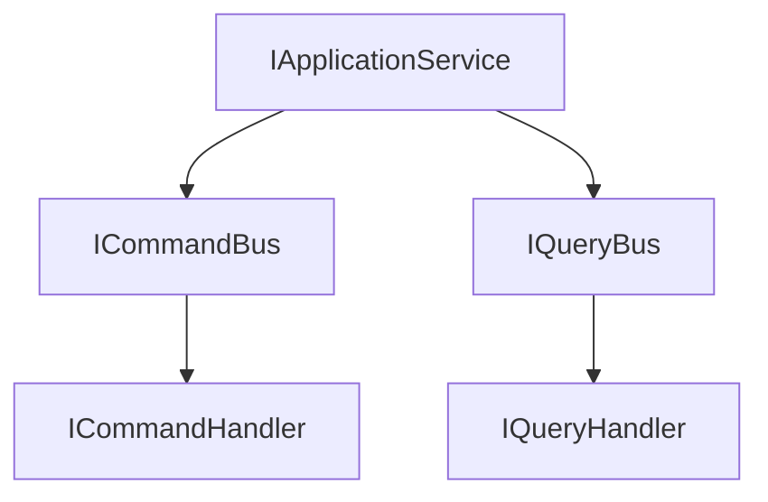
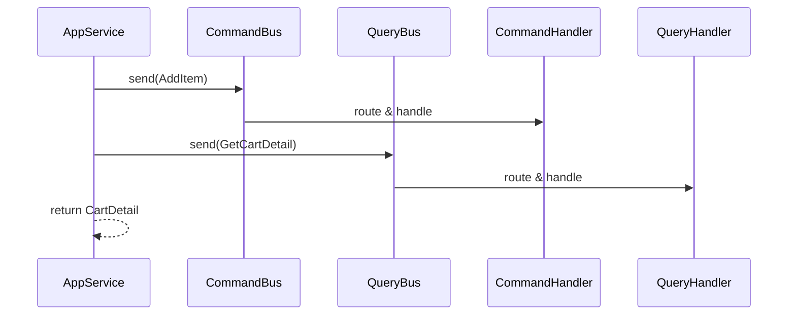

# easy-ddd-application

应用层契约与默认桥接，实现用例编排、命令查询发送入口，并与基础设施总线集成。

## 核心接口
- `IApplicationService`：应用服务标记接口，内置 `getCommandBus`/`getQueryBus` 获取与默认 `send` 方法，简化命令与查询的发送。

## 架构关系


## 示例
```java
@Service
class CartAppService implements IApplicationService {
  @Resource private ICommandBus commandBus;
  @Resource private IQueryBus queryBus;
  public ICommandBus getCommandBus() { return commandBus; }
  public IQueryBus getQueryBus() { return queryBus; }

  public CartDetail addAndQuery(AddItemCommand cmd) {
    commandBus.send(cmd);
    return queryBus.send(new GetCartDetailQuery(cmd.cartId()));
  }
}
```

## 优劣势
- 优势：统一用例入口、简化总线调用、与 Spring 容器无缝集成。
- 劣势：强依赖基础设施层的总线与自动装配；不包含具体用例模板。

关联模块：
- [easy-ddd-common](../easy-ddd-common/README.md)
- [easy-ddd-infrastructure](../easy-ddd-infrastructure/README.md)
- [easy-ddd-domain](../easy-ddd-domain/README.md)

## 用例编排范式
- 输入/输出契约：应用服务方法以用例输入 DTO 为参数、返回查询结果或状态；内部发送命令与查询。
- 事务边界：以命令为主的变更走事务；查询保持只读；跨聚合协调用事件或 BizFlow。
- 验证策略：参数校验进入应用层；业务规则校验在领域层（处理器/聚合）。

## 防腐层（ACL）建议
- 适配外部：对外部系统/模型进行适配与转换，保护领域模型不受侵蚀。
- 数据清洗：在进入应用层前进行字段校验、枚举映射、时间/货币等统一格式化。
- 网关封装：将第三方 API 封装为网关接口，应用层依赖接口，具体实现位于基础设施层。

## 编排示例（序列图）

