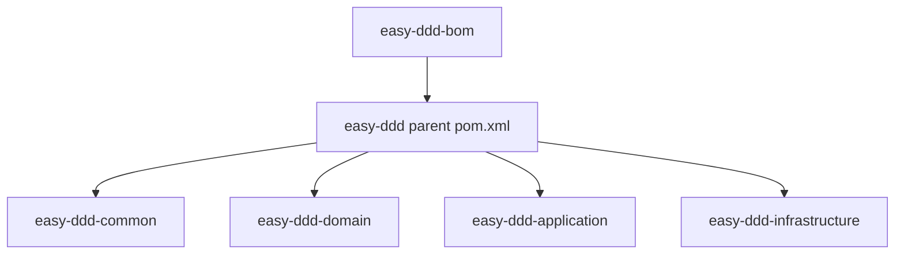

# easy-ddd-bom

用于统一管理项目依赖版本的 BOM 模块，确保各子模块依赖一致性与可控升级。

## 目录
- [easy-ddd-bom](#easy-ddd-bom)
  - [目录](#目录)
  - [职责](#职责)
  - [与子模块的关系](#与子模块的关系)
  - [使用方式](#使用方式)
  - [注意事项](#注意事项)

## 职责

- 通过父 POM 导入 Spring Boot、Hutool、MyBatis-Plus、LangChain4j、MapStruct 等版本
- 管理框架自有模块（common/domain/application/infrastructure）的版本

## 与子模块的关系



## 使用方式

- Maven（业务项目作为子模块或父工程）
```xml
<parent>
  <groupId>io.github.anthem37</groupId>
  <artifactId>easy-ddd</artifactId>
  <version>1.0-SNAPSHOT</version>
</parent>
```

- Gradle（示例，使用平台对齐）
```kotlin
dependencies {
  implementation(platform("io.github.anthem37:easy-ddd:1.0-SNAPSHOT"))
  implementation("io.github.anthem37:easy-ddd-infrastructure")
  implementation("io.github.anthem37:easy-ddd-common")
}
```

## 注意事项

- 升级依赖时建议统一在 BOM/父 POM 修改，回归子模块编译与示例
- MapStruct 处理器建议 scope=provided，避免运行时冲突（父 POM已处理）