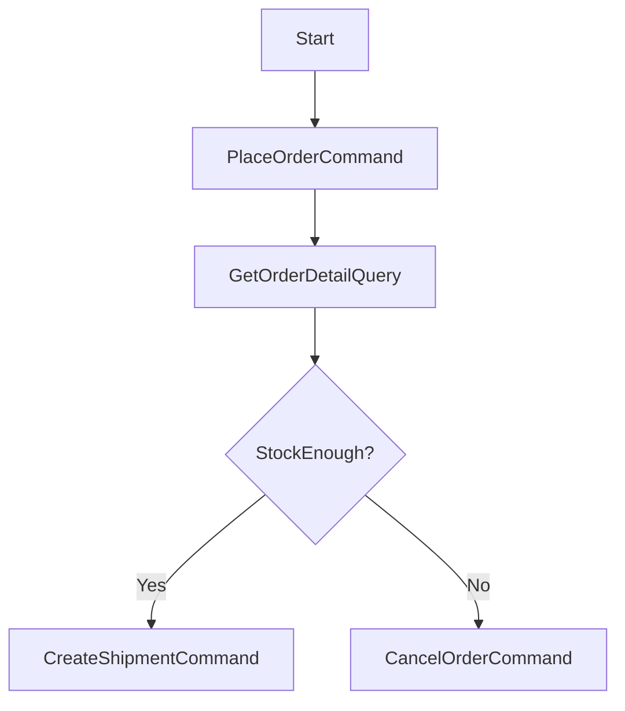

# easy-ddd-common

聚合通用契约与工具：CQRS 接口与处理器、断言工具 `Assert`、以及可组合的业务流程编排 `BizFlow`。

## CQRS 契约

- `ICommand` / `IQuery`：命令与查询标记接口，含默认校验方法。
- `ICommandHandler` / `IQueryHandler`：处理器接口，定义 `handle` 与支持类型。

## 断言工具

- `Assert`：提供 `isTrue`、`isNull`、`hasText`、`matches`、`equals` 等业务异常断言。

## BizFlow 编排

- 支持命令/查询节点、条件分支、上下文共享；可导出 PlantUML 图。

### 流程图与示例



```java
BizFlow flow = BizFlow.create("orderFlow")
        .command(new PlaceOrderCommand(...))
        .

query(new GetOrderDetailQuery(...))
        .

condition(ctx ->ctx.

get("stockEnough",Boolean .class))
        .

onTrue(() ->new

CreateShipmentCommand(...))
        .

onFalse(() ->new

CancelOrderCommand(...));

String plantUml = flow.toPlantUML();
```

## 优劣势

- 优势：通用契约统一上下文；编排可视化；与总线自然衔接。
- 劣势：需要合理拆分节点与定义上下文，避免复杂度上升。

关联模块：

- [easy-ddd-application](../easy-ddd-application/README.md)
- [easy-ddd-infrastructure](../easy-ddd-infrastructure/README.md)
- [easy-ddd-domain](../easy-ddd-domain/README.md)

## BizFlow 高级用法

- 上下文读写：节点可读写共享上下文（如 `ctx.put("orderId", id)`），下游节点通过 `ctx.get("orderId", String.class)` 读取。
- 条件编排：`condition` + `onTrue/onFalse` 组合，支持嵌套与多分支；建议保持每个分支只做一件事。
- 混合节点：支持通用函数节点（如 `flow.exec(ctx -> {...})`）以处理特殊逻辑。
- 与总线集成：命令/查询节点内部调用 `ICommandBus`/`IQueryBus`；统一异常由 `Assert` 抛出业务异常。

### 调试与导出

- 导出 PlantUML：`flow.toPlantUML()`，可在 CI 中产出图文件供评审。
- 日志与追踪：为每个节点命名（`BizFlow.create("orderFlow")`）并在日志中打印节点进入/退出；可结合 MDC 注入 `traceId`。
- 断言：在每个关键节点使用 `Assert.hasText/equals` 等保障前置条件与上下文一致性。

### 最佳实践

- 粒度控制：节点职责单一；长逻辑拆分多个节点；避免在节点内部做跨聚合复杂协调。
- 幂等：命令节点需幂等；查询节点应无副作用。
- 可测试：为每个节点提供单元测试；上下文构造使用测试工厂方法以复用。