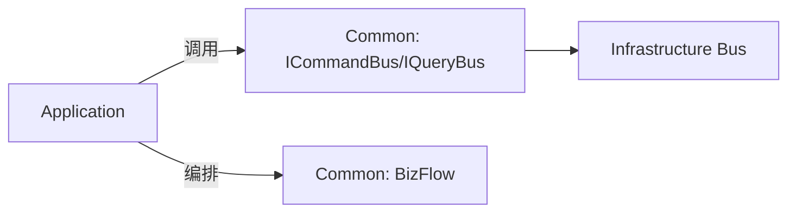

# easy-ddd-common

提供 CQRS 接口、业务断言、编排引擎 BizFlow 等通用能力，是应用层编排的基础。

## 目录
- [easy-ddd-common](#easy-ddd-common)
  - [目录](#目录)
  - [核心目录与类](#核心目录与类)
  - [模块定位图](#模块定位图)
  - [BizFlow 编排示例与导图](#bizflow-编排示例与导图)
  - [CQRS 接口用法精要](#cqrs-接口用法精要)
  - [异常与断言分层建议](#异常与断言分层建议)
  - [最佳实践](#最佳实践)
  - [测试建议](#测试建议)

## 核心目录与类

- cqrs/command
  - ICommand<R>：命令接口，默认 `isValid() = true`
  - ICommandBus：命令总线协议
  - ICommandHandler<C,R>：命令处理器接口（声明支持类型）
- cqrs/query
  - IQuery<R>、IQueryBus、IQueryHandler<Q,R>
- assertion/Assert：统一业务断言，抛 `BusinessException` 或 `BizFlowException`
- exception/BusinessException、BizFlowException
- flow/BizFlow：轻量流程编排与 PlantUML 导出

## 模块定位图



## BizFlow 编排示例与导图

```java
BizFlow flow = new BizFlow("orchestration-1", "用户注册与查询", commandBus, queryBus)
    .addCommand("createUser", "创建用户", ctx -> new CreateUserCommand(ctx.getVariable("phone", String.class)))
    .addCondition("isVip", "是否VIP", ctx -> Boolean.TRUE.equals(ctx.getVariable("vip", Boolean.class)))
    .connect("createUser", "isVip")
    .connectWhenTrue("isVip", "grantVip")
    .addCommand("grantVip", "授予VIP", ctx -> new GrantVipCommand(ctx.getResult("createUser", String.class)))
    .addQuery("getUser", "查询用户", ctx -> new GetUserQuery(ctx.getResult("createUser", String.class)))
    .connect("isVip", "getUser");

BizFlow.Context ctx = new BizFlow.Context(flow.getId());
ctx.setVariable("phone", "13800000000");
ctx.setVariable("vip", true);
BizFlow.Result result = flow.execute(ctx);

// 可视化
String plantUml = flow.toPlantUML();
```

- PlantUML 示例（可用在线渲染器渲染）
```
@startuml
!theme plain
title 用户注册与查询
state "创建用户" as createUser <<command>>
state "是否VIP" as isVip <<choice>>
state "授予VIP" as grantVip <<command>>
state "查询用户" as getUser <<query>>

createUser --> isVip
isVip --> grantVip : true
isVip --> getUser
@enduml
```

## CQRS 接口用法精要

- ICommand/IQuery：定义输入与返回类型，通过 `isValid()` 做轻校验
- Handler：
  - 必须实现 `handle()` 与 `getSupported*Type()`，供总线路由与缓存
  - 返回具体类型（如 `CreateUserCommand.class`），避免接口或 Object，确保缓存命中
- Bus：在基础设施层实现（见 infrastructure 模块）

## 异常与断言分层建议

- 编排错误：使用 `BizFlowException`（节点缺失、循环依赖、类型不匹配等）
- 业务规则失败：使用 `BusinessException`
- 系统错误：交由框架/基础设施处理（日志、告警），避免混用业务异常

建议与接口/HTTP 映射：
- BusinessException -> 400/422（请求不合法/业务不满足）
- BizFlowException -> 409（流程冲突）或 500（编排失败）
- 系统错误 -> 500

## 最佳实践

- 尽量在领域层进行不变式校验，Assert 作为防线补充
- CQRS 分离：命令改变状态，查询只读，避免副作用
- BizFlow 的 `Context` 用于在节点间传递变量与结果，注意类型安全

## 测试建议

- 为 BizFlow 编排写单元测试：构建上下文变量、执行并断言 `Result.success` 与 `getAllResults`
- 为断言工具写测试：确保异常类型与消息正确
- 使用 Mockito 隔离总线与处理器：
```java
ICommandBus cmdBus = mock(ICommandBus.class);
IQueryBus qryBus = mock(IQueryBus.class);
// when(cmdBus.send(any())).thenReturn(...);