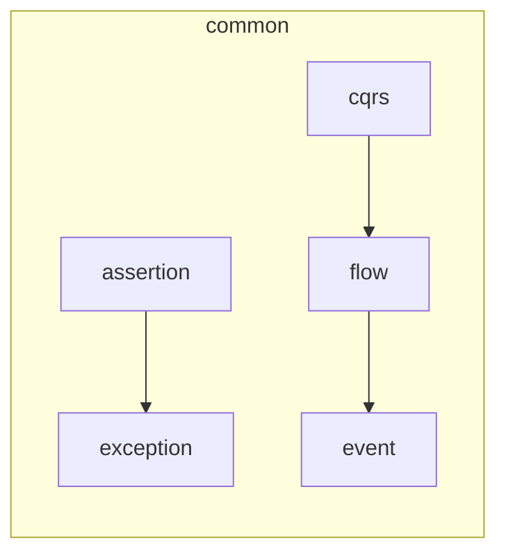

# easy-ddd-common 模块

## 模块概述
`easy-ddd-common` 提供了领域驱动设计（DDD）中常用的基础设施：

- **断言工具** (`assertion`): 简化业务断言，统一抛出业务异常。
- **CQRS 接口** (`cqrs`): 定义命令（Command）和查询（Query）的总线与处理器契约。
- **事件发布** (`event`): 定义领域事件、事件处理与发布流程。
- **BizFlow 流程引擎** (`flow`): 提供可编排的业务流程链路。
- **异常定义** (`exception`): 标准化业务异常类型。

## 包结构




## 主要组件详解

### 1. 断言工具（assertion）
- 类 `Assert` 提供 `notNull`、`isTrue` 等静态方法。
- 断言失败时抛出 `BusinessException`。

```java
Assert.notNull(entity, "实体不能为空");
```

### 2. CQRS 接口（cqrs）
- `ICommand`, `IQuery`: 标记接口。
- `ICommandBus`, `IQueryBus`: 定义 `dispatch` 方法。
- `ICommandHandler<T extends ICommand>`, `IQueryHandler<R, Q extends IQuery>`: 处理契约。

```java
// 命令定义
public class CreateUserCommand implements ICommand { ... }
// 命令处理
public class CreateUserHandler implements ICommandHandler<CreateUserCommand> { ... }
```

### 3. 事件发布（event）
- `IEvent`: 领域事件基接口。
- `IEventHandler<E extends IEvent>`: 事件处理器。
- `IEventPublisher`: 发布接口。
- 支持 `TriggeredPhase` 自定义触发时机。

### 4. BizFlow 流程引擎（flow）
- 类 `BizFlow` 支持按步骤执行、异常回滚。

```java
BizFlow.of()
    .next(ctx -> validate(ctx))
    .next(ctx -> process(ctx))
    .execute();
```

### 5. 异常类型（exception）
- `BusinessException`: 通用业务异常。
- `BizFlowException`: 流程执行异常。

## 使用示例

```java
// 断言示例
Assert.isTrue(age > 0, "年龄必须大于0");

// 命令总线
commandBus.dispatch(new CreateUserCommand(name, age));

// 事件发布
eventPublisher.publish(new UserCreatedEvent(userId));

// 流程编排
BizFlow.of()
    .next(ctx -> step1(ctx))
    .next(ctx -> step2(ctx))
    .execute();
```

---
*以上内容由 easy-ddd 团队维护，持续完善中。*