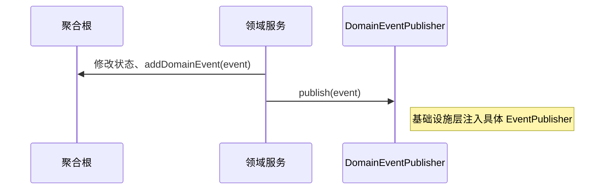

# easy-ddd-domain

纯领域层模块，定义领域模型抽象与事件协议，不依赖具体基础设施。

## 目录
- [easy-ddd-domain](#easy-ddd-domain)
  - [目录](#目录)
  - [核心类](#核心类)
  - [层内交互](#层内交互)
  - [事件触发阶段与事务边界](#事件触发阶段与事务边界)
  - [示例聚合发布事件](#示例聚合发布事件)
  - [约束与建议](#约束与建议)
  - [测试建议](#测试建议)

## 核心类

- model
  - AbstractEntity<ID>：实体基类，ID 非空校验
  - AbstractAggregateRoot<ID>：聚合根，事件收集、版本控制
  - IValueObject：值对象标记接口（强调不可变与值相等）
- event
  - IDomainEvent：领域事件协议（事件类型、数据、元数据、触发阶段、是否异步）
  - DomainEventPublisher：静态发布器入口（由基础设施注入实现）
  - TriggeredPhaseEvent：包装事件并指定触发阶段
  - IEventHandler<T>：事件处理器接口
- repository
  - IDomainRepository<T,ID>：聚合仓储抽象
- service
  - IDomainService、AbstractDomainService：发布事件、通用执行模板

## 层内交互



## 事件触发阶段与事务边界

- IN_PROCESS：同步处理（在当前事务中）
  - 适用：需要立即完成的侧效应、校验链
  - 风险：增加事务耗时，失败将影响主流程
- AFTER_COMMIT：事务提交后处理
  - 适用：外部通知、消息投递、异步集成
  - 建议：处理器实现幂等、可重试
- AFTER_ROLLBACK：事务回滚后处理
  - 适用：补偿/清理操作

选择建议：
- 写操作后尽量使用 AFTER_COMMIT，隔离外部副作用
- 失败补偿逻辑用 AFTER_ROLLBACK
- 同步链路仅限轻量且必须的步骤

## 示例聚合发布事件

```java
public class Order extends AbstractAggregateRoot<String> {
  public void create(...) {
    // 业务校验...
    addDomainEvent(new OrderCreatedEvent(this.id()));
    incrementVersion();
  }
}

public class OrderService extends AbstractDomainService {
  public String createOrder(...) {
    Order order = new Order(...);
    order.create(...);
    publishEvents(order.getDomainEvents().toArray(IDomainEvent[]::new));
    return order.getId();
  }
}
```

## 约束与建议

- 领域层不依赖 Spring，只依赖抽象协议
- 仓储接口由基础设施具体实现注入
- 值对象不可变，重写 equals/hashCode
- 领域事件数据应足够描述上下文（eventData/metadata）

## 测试建议

- 针对聚合根的单元测试：不变式与事件收集（hasUnpublishedEvents）
- 针对领域服务：发布事件数量与类型断言（使用自定义 EventPublisher stub）