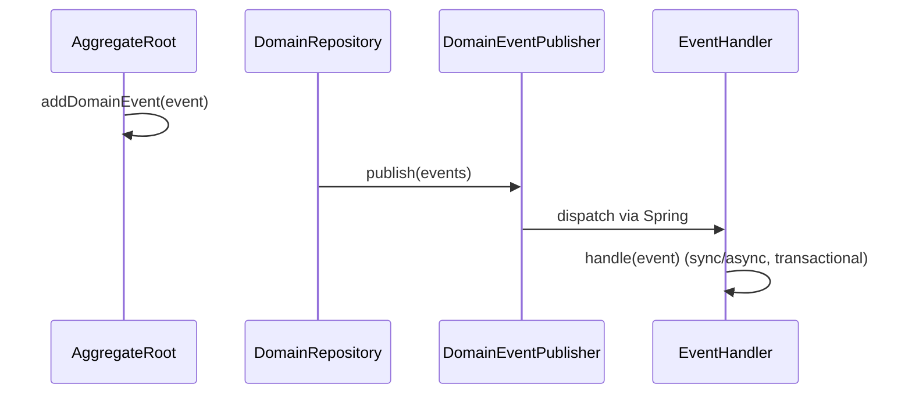
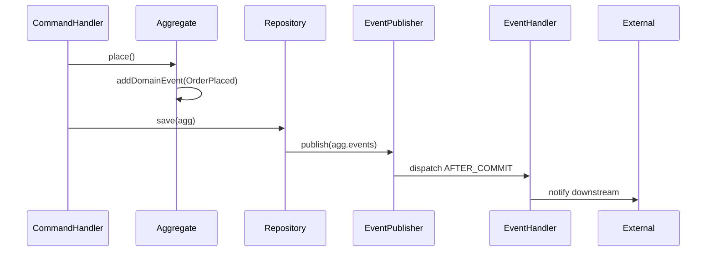

# easy-ddd-domain

提供领域模型基类与事件机制，包括实体/聚合根、领域事件与处理器、仓储接口与领域服务基类。

## 主要类型
- `AbstractEntity`：实体基类，封装唯一 ID 与生命周期校验。
- `AbstractAggregateRoot`：聚合根基类，支持领域事件收集与版本控制。
- `IDomainEvent`：领域事件契约，定义事件类型、聚合 ID、数据与元信息。
- `IEventHandler` / `AbstractEventHandler`：事件处理器接口与 Spring 集成基类，支持事务阶段 `AFTER_COMMIT` 等。
- `IDomainRepository` / `AbstractDomainRepository`：仓储接口与基础实现（发布聚合根事件）。
- `AbstractDomainService`：领域服务基类，提供发布单个/多个事件与带事件的业务执行封装。

## 事件触发模式


## 示例
```java
record OrderPlacedEvent(String orderId) implements IDomainEvent {
  public String getEventType() { return "order.placed"; }
  public Object getAggregateId() { return orderId; }
}

class OrderAgg extends AbstractAggregateRoot<String> {
  void place() { addDomainEvent(new OrderPlacedEvent(getId())); }
}
```

## 优劣势
- 优势：事件驱动的领域模型表达、聚合根版本管理、与 Spring 事务事件无缝衔接。
- 劣势：需要明确事件边界与一致性策略；仓储需结合持久化实现。

关联模块：
- [easy-ddd-infrastructure](../easy-ddd-infrastructure/README.md)
- [easy-ddd-common](../easy-ddd-common/README.md)
- [easy-ddd-application](../easy-ddd-application/README.md)

## 事件建模实践
- 语义化命名：事件名称遵循领域语言（如 `order.placed` 而非技术术语）。
- 聚合标识：`getAggregateId()` 返回与聚合根一致的标识，便于追踪与审计。
- 数据最小化：事件包含完成处理所需的最小数据，避免泄露实现细节。
- 阶段控制：默认 `AFTER_COMMIT`；需同步触发时使用 `IN_PROCESS`；回滚补偿用 `AFTER_ROLLBACK`。

## 仓储策略
- 统一发布：在 `save`/`update` 后统一发布聚合根收集的事件，避免散落发布。
- 版本与并发：聚合根可维护版本号用于乐观锁；命令处理器应确保幂等。
- 映射与持久化：仓储实现负责模型与持久化对象的映射（可用 MapStruct/JPA/Hibernate）。

## 一致性模式
- 最终一致性：跨聚合通过事件驱动实现最终一致性；可在事件处理器中执行异步操作。
- 同步一致性：在同一事务内进行校验与变更（命令处理器内），必要时使用 `IN_PROCESS` 事件。
- 补偿与回滚：使用 `AFTER_ROLLBACK` 事件触发补偿逻辑（如撤销外部副作用）。

## 扩展示例（序列图）
