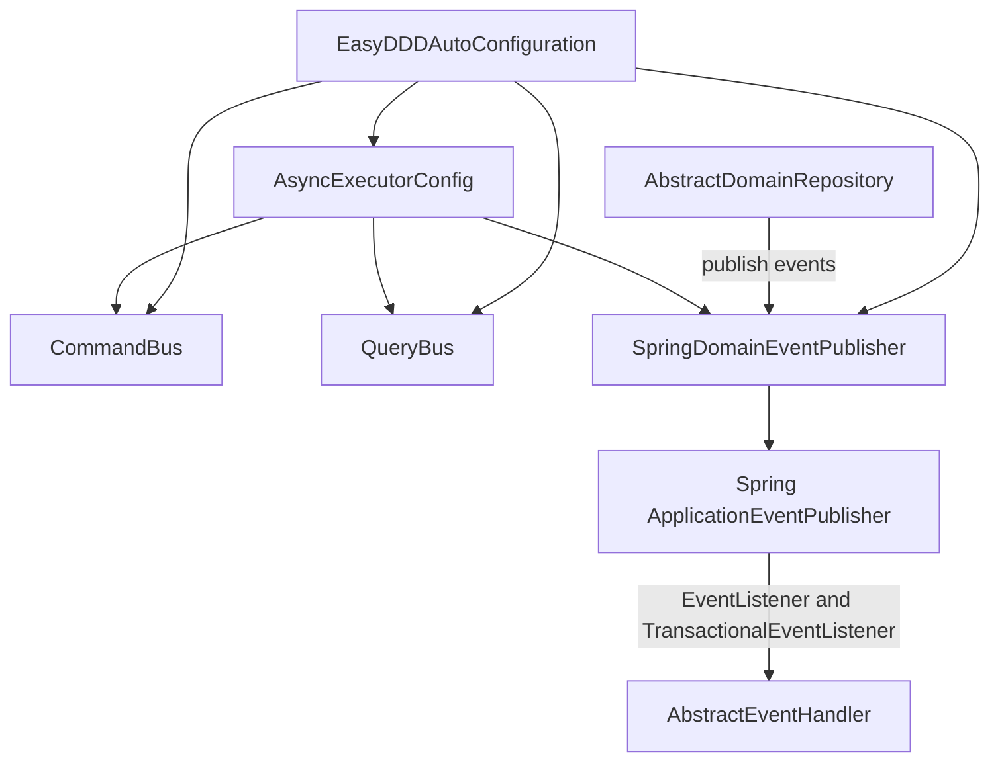

# easy-ddd-infrastructure

提供与 Spring 深度集成的基础设施实现：命令/查询总线、领域事件发布与处理、通用仓储骨架，以及异步执行器自动配置。

关联模块：
- 上层应用服务契约：[easy-ddd-application](../easy-ddd-application/README.md)
- 领域模型与事件：[easy-ddd-domain](../easy-ddd-domain/README.md)
- 通用接口与编排：[easy-ddd-common](../easy-ddd-common/README.md)

## 主要组件
- `EasyDDDAutoConfiguration`：自动装配 `ICommandBus`、`IQueryBus`、`DomainEventPublisher`，并注入异步执行器。
- `CommandBus` / `QueryBus`：实现消息总线，扫描并缓存处理器，路由命令/查询到对应 Handler。
- `SpringDomainEventPublisher`：基于 Spring `ApplicationEventPublisher` 的发布器，支持同步/异步与事务阶段触发。
- `AbstractEventHandler`：事件处理基类，内置 `@EventListener` 与 `@TransactionalEventListener` 机制。
- `AbstractDomainRepository`：仓储通用骨架，封装聚合根 CRUD 与事件发布（保存/更新后聚合根事件自动发布）。
- `AsyncExecutorConfig`：为命令、查询、事件分别提供可监控的线程池（`commandExecutor`/`queryExecutor`/`eventExecutor`）。

## 架构图



## 使用步骤
1. 引入 `easy-ddd-infrastructure` 依赖，确保自动装配生效（Spring Boot 环境）。
2. 定义命令/查询与处理器，并声明为 Spring Bean：

```java
class PlaceOrderCommand implements ICommand<String> { /* 字段与校验 */ }

@Component
class PlaceOrderHandler implements ICommandHandler<PlaceOrderCommand, String> {
  public String handle(PlaceOrderCommand cmd) { /* 下单逻辑 */ return "OK"; }
  public Class<PlaceOrderCommand> getSupportedCommandType() { return PlaceOrderCommand.class; }
}

class GetOrderQuery implements IQuery<Order> { /* 参数 */ }

@Component
class GetOrderHandler implements IQueryHandler<GetOrderQuery, Order> {
  public Order handle(GetOrderQuery q) { /* 查询逻辑 */ return new Order(); }
  public Class<GetOrderQuery> getSupportedQueryType() { return GetOrderQuery.class; }
}
```

3. 使用仓储骨架并在聚合根中添加事件：
```java
class OrderAgg extends AbstractAggregateRoot<String> {
  void markPlaced() { addDomainEvent(new OrderPlacedEvent(getId())); }
}

abstract class OrderRepository extends AbstractDomainRepository<OrderAgg, String> { /* 具体持久化 */ }
```

4. 编写事件处理器，支持同步/异步与事务阶段：
```java
@Component
class OrderPlacedHandler extends AbstractEventHandler<OrderPlacedEvent> {
  public Class<OrderPlacedEvent> getSupportedEventType() { return OrderPlacedEvent.class; }
  protected void doHandle(OrderPlacedEvent e) { /* 发消息、回写索引等 */ }
}
```

5. 可选：在配置中调整异步执行器参数：
```yaml
easy:
  ddd:
    async:
      query:
        queueCapacity: 200
      command:
        maxPoolSizeMultiplier: 2.0
      event:
        keepAliveSeconds: 300
```

## 适用场景与优劣势
- 适用：需要在 Spring 环境中快速落地 CQRS、领域事件与异步化；对事件的事务边界有明确要求（如 AFTER_COMMIT）。
- 优势：自动装配、处理器缓存路由、事务事件机制、线程池可观测与调优。
- 劣势：强依赖 Spring Boot；具体 DAO/ORM 需自行实现；事件发布器默认注册为全局，测试需按需注入或替换。

## 配置项详解（AsyncExecutorConfig）
- 属性前缀：`easy.ddd.async.*`
- 通用属性：
  - `corePoolSizeMultiplier`：核心线程数乘数（乘以 CPU 核心数），默认 `1.0`
  - `maxPoolSizeMultiplier`：最大线程数乘数，默认 `1.5`（事件可设为 `2.0`）
  - `queueCapacity`：队列容量，默认 `query=50`、`command=200`、`event=500`
  - `keepAliveSeconds`：空闲线程存活时间，默认 `query=60`、`command=120`、`event=300`
  - `rejectedExecutionPolicy`：拒绝策略，`CALLER_RUNS`/`DISCARD_OLDEST`/`DISCARD`/`ABORT`
  - `waitForTasksToCompleteOnShutdown`：关闭时是否等待任务完成
  - `awaitTerminationSeconds`：关闭等待超时时间（秒）
- Bean 名称：`queryExecutor` / `commandExecutor` / `eventExecutor`

示例：
```yaml
easy:
  ddd:
    async:
      command:
        corePoolSizeMultiplier: 1.0
        maxPoolSizeMultiplier: 1.5
        queueCapacity: 200
        keepAliveSeconds: 120
        rejectedExecutionPolicy: CALLER_RUNS
      event:
        maxPoolSizeMultiplier: 2.0
        queueCapacity: 500
        keepAliveSeconds: 300
```

## 事件事务阶段与处理
- 事件阶段枚举：`IN_PROCESS`、`AFTER_COMMIT`、`AFTER_ROLLBACK`（默认 `AFTER_COMMIT`）。
- 处理机制（`AbstractEventHandler`）：
  - `@EventListener`：处理 `IN_PROCESS` 事件（同步）。
  - `@TransactionalEventListener(TransactionPhase.AFTER_COMMIT)`：处理提交后的事件。
  - `@TransactionalEventListener(TransactionPhase.AFTER_ROLLBACK)`：处理回滚后的事件。
- 指定阶段：通过 `TriggeredPhaseEvent` 包装事件以指定明确阶段。

示例：
```java
// 指定在事务提交后触发
publisher.publish(new TriggeredPhaseEvent(domainEvent, TriggeredPhase.AFTER_COMMIT));

// 同步触发（无事务）
publisher.publish(new TriggeredPhaseEvent(domainEvent, TriggeredPhase.IN_PROCESS));
```

## 调优建议
- 命令与查询：偏 CPU 密集，建议乘数在 1.0~1.5；根据并发调整队列容量。
- 事件：偏 IO 密集，乘数可提升至 2.0，队列容量增大以削峰。
- 监控：扩展 `MonitorableThreadPoolTaskExecutor` 以暴露线程池指标；结合 `Micrometer` 上报。
